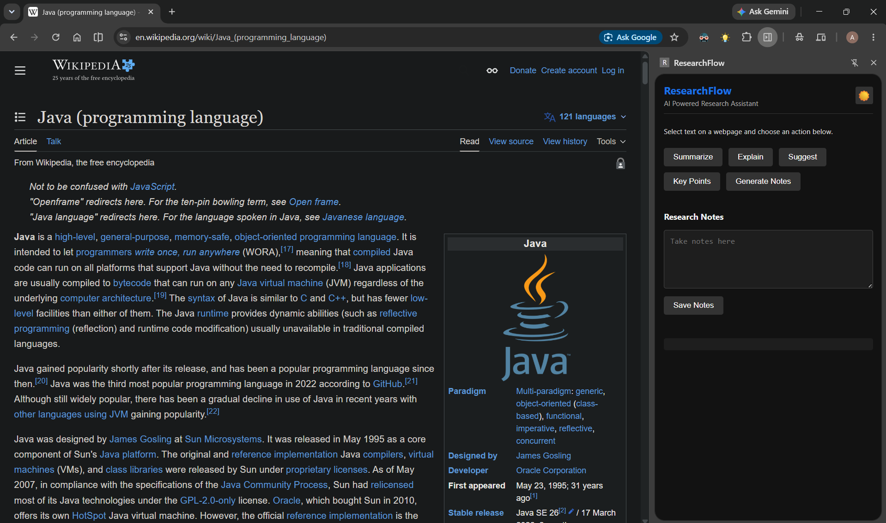
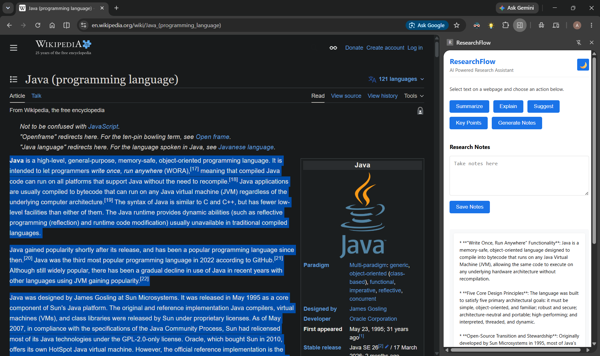
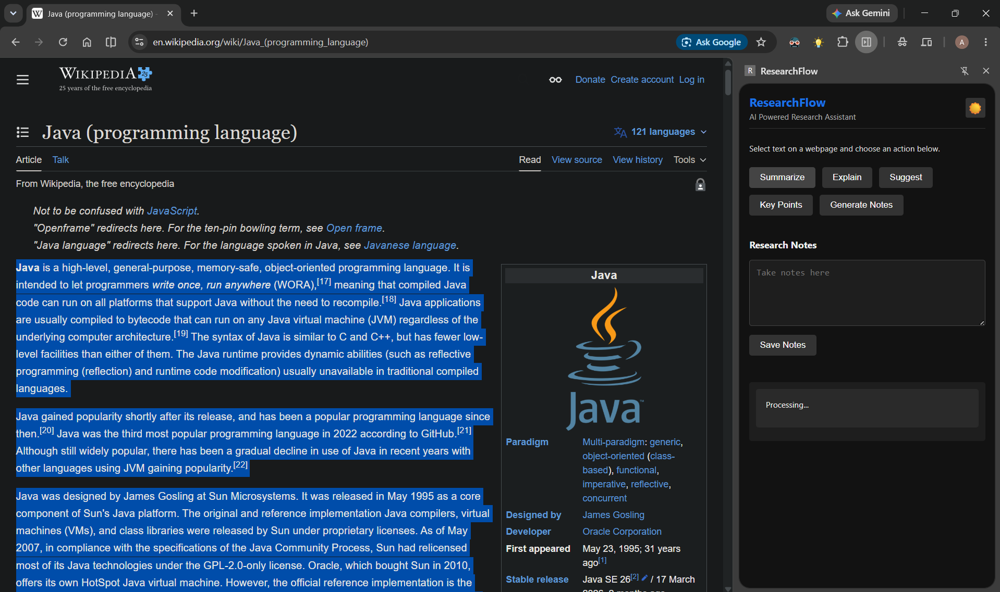
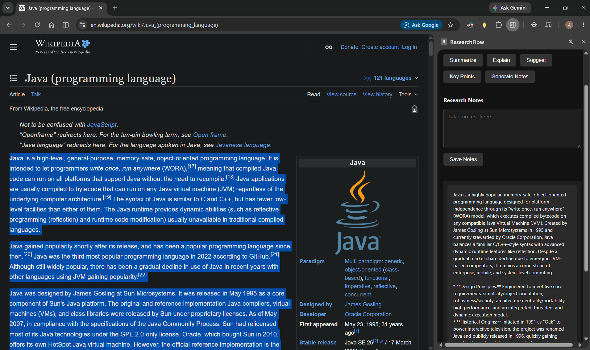
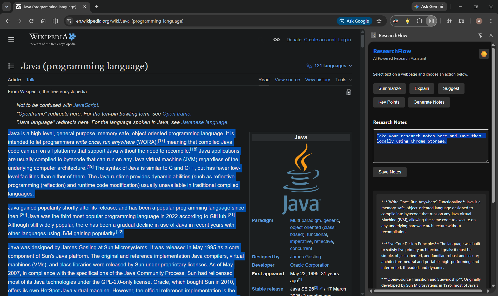

# ResearchFlow

AI-Powered Research Assistant Chrome Extension built with Java, Spring Boot, and Modern Web Technologies.

---

## Overview

ResearchFlow is a Chrome Extension that enhances online research by providing AI-powered tools directly within the browser. Users can select text from any webpage and instantly generate summaries, explanations, key points, structured notes, and intelligent suggestions.

The extension communicates with a Spring Boot backend that processes the selected content using AI models and returns actionable insights in real-time.

---

## Features

### AI-Powered Research Tools

* Summarize selected content
* Explain complex concepts
* Extract key points
* Generate structured notes
* Provide research suggestions

### Research Notes

* Built-in note-taking workspace
* Persistent note storage using Chrome Storage API
* Easy note management during research sessions

### User Experience

* Modern side panel interface
* Light and Dark mode support
* Fast response times
* Clean and intuitive workflow

### Developer-Friendly Architecture

* Chrome Extension frontend
* Spring Boot backend
* RESTful API communication
* Easily extensible for future AI capabilities

---

## Architecture

```text
┌──────────────────┐
│     Web Page     │
└────────┬─────────┘
         │ Selected Text
         ▼
┌──────────────────┐
│   ResearchFlow   │
│ Chrome Extension │
└────────┬─────────┘
         │ REST API Request
         ▼
┌──────────────────┐
│   Spring Boot    │
│     Backend      │
└────────┬─────────┘
         │
         ▼
┌──────────────────┐
│    AI Service    │
│  (LLM Provider)  │
└────────┬─────────┘
         │
         ▼
┌──────────────────┐
│ Research Insights│
└──────────────────┘
```

---

## Technology Stack

### Frontend

* HTML5
* CSS3
* JavaScript (ES6+)
* Chrome Extension APIs

### Backend

* Java
* Spring Boot
* Spring Web
* Maven

### Storage

* Chrome Storage API

### AI Integration

* AI Model Integration through Spring Boot Services
* Extensible for OpenAI, Ollama, Gemini, Claude, or Local Models

---

## Project Structure

```text
ResearchFlow/
│
├── extension/
│   │
│   ├── manifest.json
│   ├── sidepanel.html
│   ├── sidepanel.css
│   ├── sidepanel.js
│   └── background.js
│
├── backend/
│   │
│   ├── src/main/java/
│   │   ├── controller/
│   │   ├── service/
│   │   ├── config/
│   │   ├── enums/
│   │   ├── dto/
│   │   └── ResearchFlowApplication.java
│   │
│   └── src/main/resources/
│       └── application.properties
│
└── README.md
```

---

## Available Actions

ResearchFlow currently supports the following AI operations:

| Action         | Description                                  |
| -------------- | -------------------------------------------- |
| Summarize      | Generates a concise summary                  |
| Explain        | Explains concepts in simple language         |
| Key Points     | Extracts important points                    |
| Generate Notes | Creates structured notes                     |
| Suggest        | Provides additional insights and suggestions |

---

## Installation

### Clone the Repository

```bash
git clone https://github.com/AbhirajSingh-10/AI-Research-Assistant-Extension.git
```

```bash
cd AI-Research-Assistant-Extension
```

---

## Backend Setup

Navigate to the backend project:

```bash
cd backend
```

Build the application:

```bash
mvn clean install
```

Run the Spring Boot application:

```bash
mvn spring-boot:run
```

Alternatively, launch:

```text
ResearchFlowApplication.java
```

directly from your IDE.

The backend starts on:

http://localhost:8080

---

## Chrome Extension Setup

### Load the Extension

1. Open Google Chrome
2. Navigate to:

chrome://extensions

3. Enable Developer Mode
4. Click "Load Unpacked"
5. Select the extension directory
6. Pin ResearchFlow to the Chrome toolbar

---

## Usage

### Summarize Content

1. Open any webpage
2. Select text
3. Open ResearchFlow
4. Click "Summarize"
5. View AI-generated summary

### Explain Content

1. Select text
2. Click "Explain"
3. Receive a simplified explanation

### Generate Notes

1. Select text
2. Click "Generate Notes"
3. Structured notes appear in the results section

### Save Notes

1. Write notes in the Research Notes section
2. Click "Save Notes"
3. Notes are stored locally using Chrome Storage

---

## API Endpoint

### Process Research Content

```text
POST /api/research/process
```

Request:
```text
{
  "content": "Selected webpage content",
  "operation": "SUMMARIZE"
}
```


Supported Operations:

SUMMARIZE
EXPLAIN
KEY_POINTS
GENERATE_NOTES
SUGGEST

---

## Current Capabilities

* Text Summarization
* Concept Explanation
* Key Point Extraction
* Note Generation
* Research Suggestions
* Dark Mode
* Persistent Notes
* Chrome Side Panel Integration

---

## Screenshots

### Main Interface



### Light Mode



### AI Summary




### Research Notes



---


## Author

Abhiraj Singh Chouhan

Aspiring Full-Stack Java Developer passionate about AI-powered productivity tools, Spring Boot, and intelligent software systems.

---

### If you find this project useful, consider giving it a star.

⭐ Star the repository and contribute to make ResearchFlow even better.
